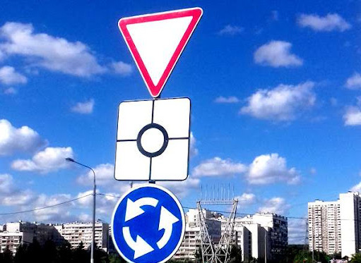

# Driving Assistant

This project implements a YOLO model trained on [Traffic Signs Detection Europe Computer Vision dataset](https://universe.roboflow.com/radu-oprea-r4xnm/traffic-signs-detection-europe) to detect (Object Detection) and describe (LLM) road signs in real time.

## Installation

Create a `.env` file in the root directory and set your Fireworks API key

```text
FIREWORKS_API_KEY=<YOUR FIREWORKS API KEY>
```
```[OPTIONAL]```You can also set the following optional environment variables in the `.env` file:
```text
OBJ_DETECT_WEIGHTS_PATH=<Path to the YOLO weights>
CATEGORY_MAPPING_PATH=<Path to the class_id to sign_code mapping file>
CONFIDENCE_THRESHOLD=<Object detection confidence threshold>
MAX_TOKENS=<Maximum number of tokens to generate>
TEMPERATURE=<Temperature for completition generation>
IMAGE_WIDTH=<Width of the input image>
IMAGE_HEIGHT=<Height of the input image>
API_HOST=<Host for the FastAPI server>
API_PORT=<Port for the FastAPI server>
FIREWORKS_API_KEY=<API key for the Fireworks LLM API>
AVAILABLE_LLMS=<List of supported LLMs for Fireworks API>
SIGN_INFO_URL_TEMPLATE=<URL template for searching traffic sign information>
SIGN_IMAGE_URL_TEMPLATE=<URL template for searching traffic sign images>
```

### Without Docker
1. python 3.12 is required
2. Install Python packages dependencies `pip install -r requirements.txt`
3. Download YOLO weights `RUN gdown --fuzzy https://drive.google.com/file/d/1q9M9w4r16Bp7T6wh-lHXJPnCcA1rSNF-/view?usp=sharing` (Otherwise it will download automatically on first run).
4. Run `python -m src.models.api`

### Docker
1. Run `docker build -t traffic-sign-detect .`
2. Run `docker run -p 8000:8000 traffic-sign-detect` (or any other port specified in the `.env` file)

## Model training
1. Get your Roboflow API key from [Roboflow](https://docs.roboflow.com/api-reference/authentication)
2. Set the `ROBOFLOW_API_KEY` environment variable in the `src/train_obj_detection/.env` file.
3. Download the dataset using Jupiter notebook `src/train_obj_detection/download_dataset.ipynb`
4. Train the YOLO model using Jupiter notebook `src/train_obj_detection/train.ipynb`
5. Move or set new weights path in the `.env` file.

## API Reference
If running the API locally, it can be accessed on http://127.0.0.1:8000 by default, the IP and port can be changed in the `.env` file.

### ```[GET]```: /api/available_models

Returns the list of available LLMs for the Fireworks API.

**Returns:**
  - **llm_models**: The list of available LLMs.

### ```[GET]```: /api/available_classes

Returns the list of available classes (road signs) for the YOLO model.

**Returns:**
  - **classes**: The list of available classes.

### ```[POST]```: /api/predict

Predicts the road signs in the input image.

| Parameter | Type     | Description                       |
| :-------- | :------- | :-------------------------------- |
| `image`      | `image/*` | **Required**. An image to generate predictions for |
| `llm_model_name`      | `string` | **Optional**. The name of an LLM to be used. (Defaults to `llama-v3p1-405b-instruct`) |
| `confidence_threshold`      | `float` | **Optional**. The confidence threshold for object detection. (Defaults to `0.5`) |

The following LLMs are supported:
- `llama-v3p1-405b-instruct`
- `llama-v3p1-70b-instruct`
- `llama-v3p1-8b-instruct`
- `llama-v3-70b-instruct`
- `mixtral-8x22b-instruct`
- `mixtral-8x7b-instruct`

**Returns:**
  - **hints**: The hints generated by the LLM model.

## Examples
Using endpoint `/api/predict` with the following payload:
```json
{
  "image": "<image file>",
  "llm_model_name": "llama-v3p1-405b-instruct",
  "confidence_threshold": 0.5
}
```
Image is:



The response will look like:
```json
{
  "hints": "Give way to traffic on the main road ahead. Be prepared to stop if necessary. As you approach the roundabout, signal your exit before entering and yield to traffic already in the roundabout. Keep to the designated lane and follow the direction indicated by the arrows. Reduce speed and be alert for pedestrians and other vehicles."
}
```